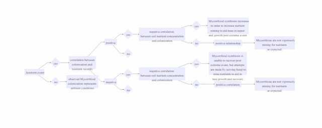
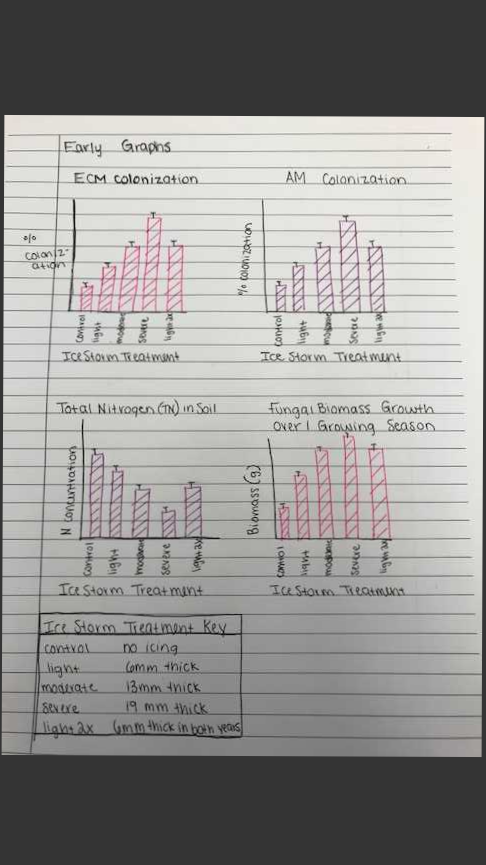

The above flowchart represents a logic tree of sorts that will help me to walk through my data and results as they are processed. In the experiment I am conducting, I am quanitfying the degree to which mycorrhizal symbiosis between the fungi and the tree species with which they associate are effected by varying severity of ice storm. I hypothesize that as ice storm severity increases, there will be a subsequent increase in mycorrhizal colonization. As a result of increased colonization, I expect to see a a general decrease in Total Nitrogen found in the soil. I believe this will happen because, as ice storm severity increases, there will be ever increasing damage to the trees. As a result, the trees will put out signaling to recruit mycorrhizae, which will in turn mine for nitrogen in the soil, which is often the limiting nutrient for trees in Northern Hardwood forests. As a result more severe ice storm plots will exhibit a decrease of N in their soils as mycorrhizae are vigorously mining it to aid in tree repair.

The early graphs above are visual represenations of the results I hope to attain in order to reach some of the conclusions I described above. ECM or ectomycorrhizal fungi and AM or arbuscular mycorrhizae are two different types of fungi that form similar symbiosis patterns with trees. I expect an increase in fungal biomass as ice storm severity increases because I believe the trees will be trying to recruit and encourage fungal growth to allow them access to embedded Nitrogen in the soil.I hypothesize that trees will be recruiting fungi through the release of carbon which these fungi need to grow. If the trees are under great stress I hypothesize that they will release higher amounts of carbon to recruit higher amounts of mycorrhizae.