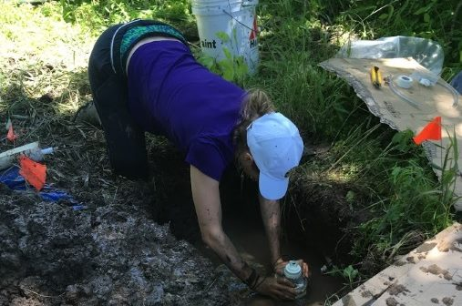

# Computational Biology 381 Spring 2018

 Hi, my name is Colleen Yancey and I am an Undergraduate Researcher with the Adair Lab Group at the University of Vermont. I am interested in studying microbial communities and their response to extreme weather events in a changing world. I am particularly interested in the effects that extreme ice storms have on mycorrhizal symbiosis with trees in North American hardwood forests, as well as the impacts of extreme rain events on denitrifying microbial communities in riparian zones.

[Here is a link to the Adair Lab Group Webpage](http://adairlab.weebly.com/team.html)

##Homework Assignments
Below are links to completed homework assignments.

###Homework 1
The first homework was to create the webpage and get it linked to GitHub!

###Homework 2
[Thinking on Paper-early graphs for research](GraphImages.html)

###Homework 3
[Beamer Presentation Converted to PDF](Beamer1.pdf)

###Homework 4
[R Vectors and Equations](homework4.html)

###Homework 5
[Working with Regular Expressions](homework5.html)

###Homework 6
[Probability Distributions and Simulating Data](homework6.html)

###Homework 7
[Creating Fake Data Sets to Simulate Experiments](homework7.html)

###Test